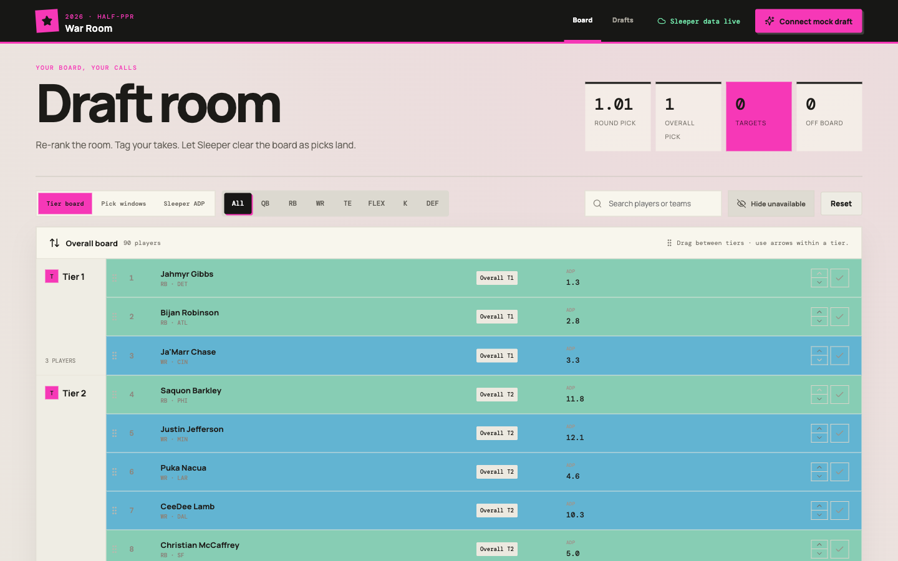
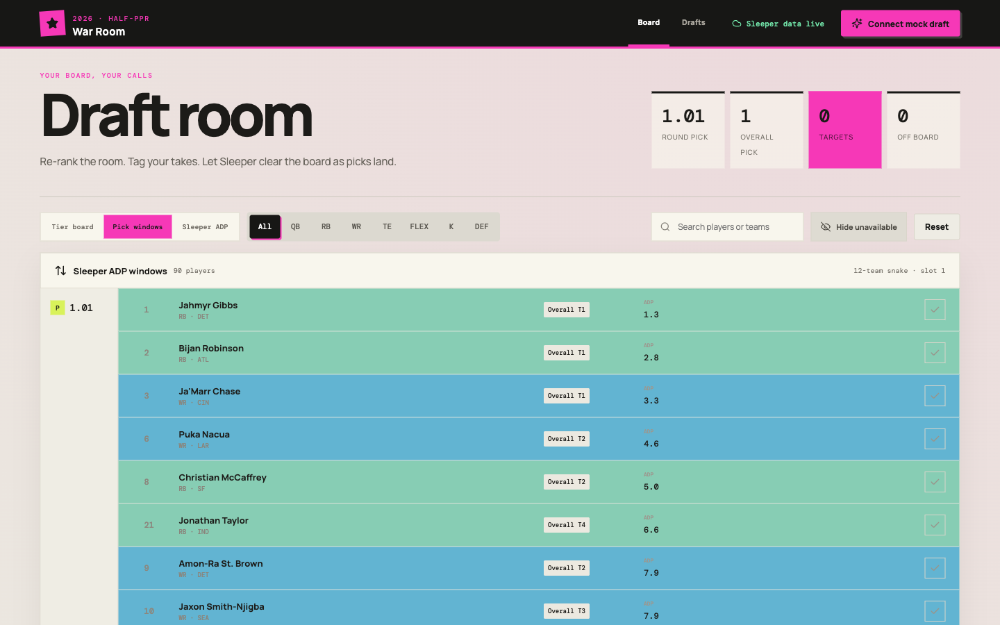
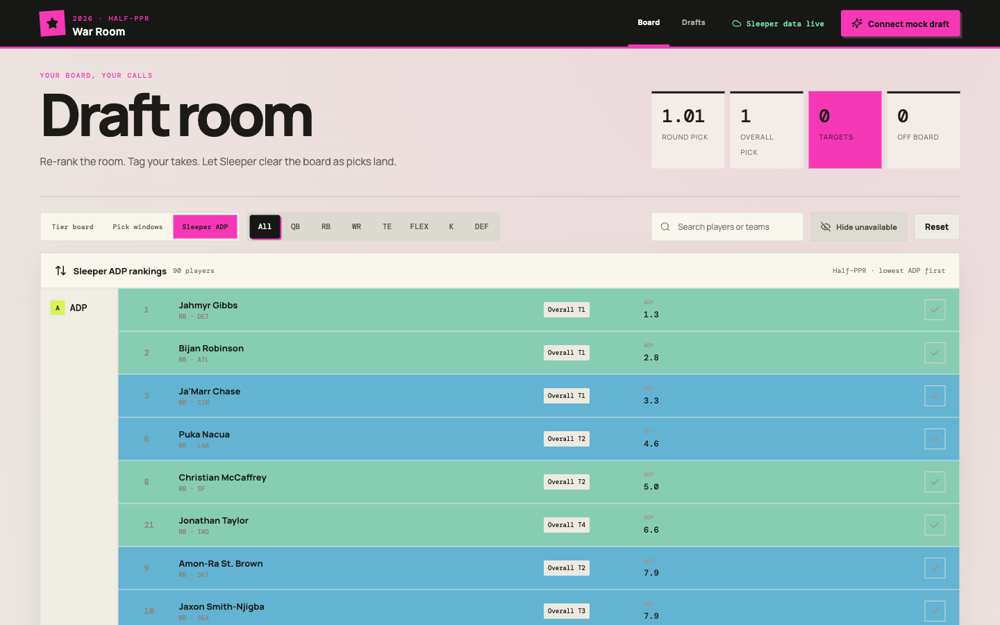

# 2026 Draft Room

An interactive half-PPR draft companion with a persistent personal tier board, live Sleeper enrichment, mock-draft history.

Rankings are imported through the browser and saved as parsed board state, with Supabase as the local backend database. This is a web app which never writes files back to your filesystem (webapps don't have permissions to your modify your local filesystem).



<details>
<summary>More screenshots</summary>

**Pick windows** — players grouped by your upcoming snake-draft picks:



**Sleeper ADP** — a flat board sorted lowest to highest ADP:



</details>

## Quick start

Prerequisites: Node.js 20+, npm, and Docker Desktop (or another Docker-compatible runtime), running before Supabase starts.

```bash
npm install
cp .env.example .env
npm run supabase:start
npm run supabase:status
```

Copy the API URL and browser-safe **Publishable** key printed by `npm run supabase:status` into `.env`:

```dotenv
VITE_SUPABASE_URL=http://127.0.0.1:54321
VITE_SUPABASE_PUBLISHABLE_KEY=sb_publishable_your_local_key
```

Then validate, migrate, and start the app:

```bash
npm run env:validate
npm run supabase:migrate
npm run dev
```

### Import your rankings

Open the Vite URL printed in the terminal. On the empty board, select **Import rankings CSV**, drop or choose a CSV, review the preview, and select **Apply import**. `rankings.example.csv` in the repository root is a ready-made sample board (the screenshots above use it) if you want to try the import before preparing your own rankings.

The CSV must have these exact columns in this order:

```csv
Overall,Player,Position,Pos Rank,Tier,Auction (Out of $200)
1,Example Runner,RB,1,1,$60
```

## Supabase in brief

The app persists boards, draft history, and coach memories to a local Supabase Docker stack; when Supabase is unconfigured or unreachable, board edits fall back to browser local storage. Supabase Studio is available at `http://127.0.0.1:54323`. The checked-in policies intentionally give the anonymous role full access for single-user local development — do not deploy them to a hosted project unchanged (see [docs/supabase.md](docs/supabase.md)).

## Deeper dives

- [docs/supabase.md](docs/supabase.md) — step-by-step Supabase setup, lifecycle commands, the local-only security model, and the persistence schema
- [docs/environment.md](docs/environment.md) — every environment variable and the `env:validate` checker
- [docs/draft-workflow.md](docs/draft-workflow.md) — board editing, mock-draft sync, resets, and rankings-import semantics
- [docs/coach.md](docs/coach.md) — running the AI coach, its knowledge base, and chat memory
